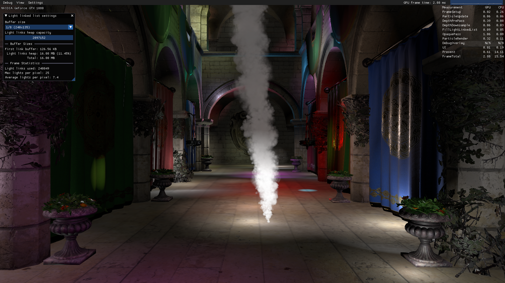

ThreeL: An implementation of lighting via light linked list
===============================================================================

ThreeL is an implementation of [real-time lighting via light linked list](https://advances.realtimerendering.com/s2014/#_REAL-TIME_LIGHTING_VIA) as described by Abdul Bezrati from Insomniac Games.

I'm still working on polishing ThreeL (and this readme), but the project is fully functional and mostly feature complete. I plan to publish a blog post and binaries for ThreeL soon.

The project utilizes relatively thin abstractions, hopefully making it more friendly for beginners to learn something from. In this renderer you'll find:

* Direct3D 12
* Physically-based rendering (matching the [core glTF feature set](https://registry.khronos.org/glTF/specs/2.0/glTF-2.0.html#appendix-b-brdf-implementation))
* A forward renderer with a depth pre-pass an unusual lighting algorithm
* Generating mipmap chains in compute
* Compute-based particle systems
* Basic glTF loading (non-conformant, it's restricted to the features needed by ThreeL)
* Bindless rendering (Specifically for textures/samplers used by PBR materials and some mesh data)
* A few little Dear ImGui-based tools for fiddling with things

## Controls

Move with <kbd>WASD</kbd>\*, click and drag to look around. Hold <kbd>Shift</kbd> to sprint, <kbd>Ctrl</kbd> to move slowly.

You can also use an Xbox Controller. Click in the left stick to sprint.

Various debug visualizations, settings, and tools can be accessed using the UI.

(\*Or <kbd>ZWSD</kbd> or <kbd>,AOE</kbd> or <kbd>WARS</kbd> whatever your keyboard uses for those keys. Arrow keys work too.)

## Building

Building should be as simple as opening `ThreeL.sln` in Visual Studio 2022 and pressing F5.

&nbsp;

ThreeL has three build configrations:

* Debug - Code optimizations disabled (including shaders) with debug layer & asserts – slowest
* Checked - Optimizations enabled with asserts only – faster
* Release - Optimizations enabled without asserts – fastest

The debug and checked configurations are instrumented with [WinPixEventRuntime](https://devblogs.microsoft.com/pix/winpixeventruntime/) if you're wanting to inspect the structure of the frame using [PIX](https://devblogs.microsoft.com/pix/download/) or [RenderDoc](https://renderdoc.org/).

## License

ThreeL is licensed under the MIT License. [See the license file for details](LICENSE.txt).

Additionally, ThreeL has some third-party dependencies. [See the third-party notice listing for details](THIRD-PARTY-NOTICES.md).
